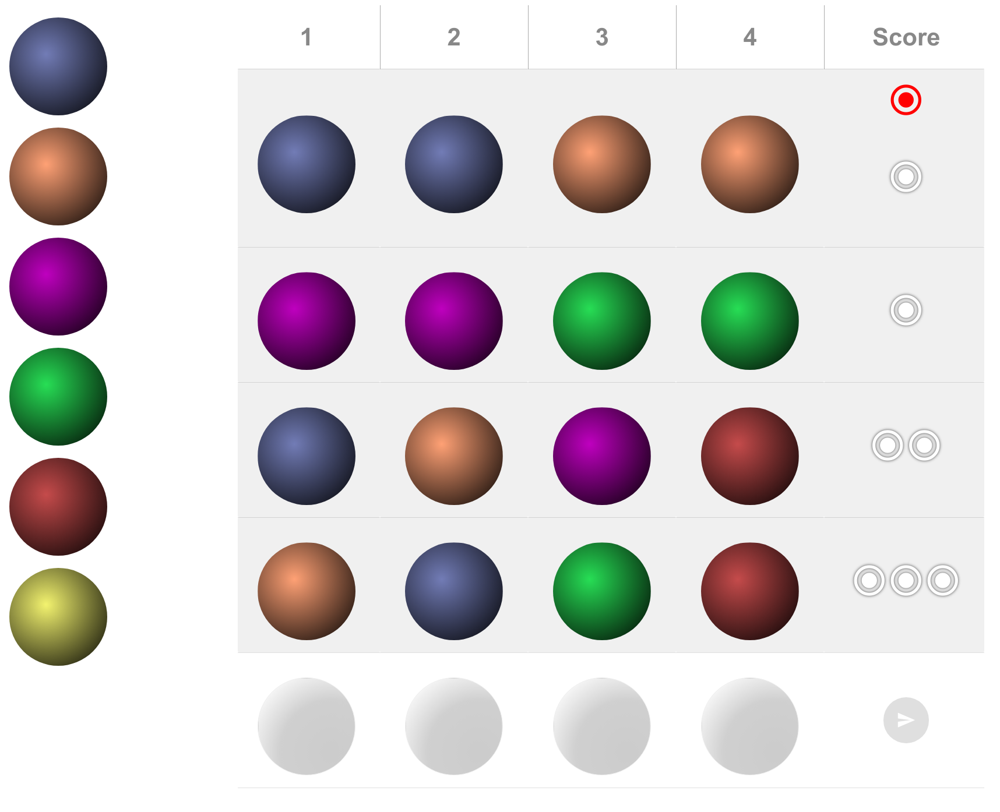

### Simple Mastermind Game

This is a simple mastermind game that I use for labs.

It consists of three components:

1. `mastermind` is the logic of the game itself. The interface is
   defined in `lib/mastermind.ex`, and the implementation's in the
   directory below.

2. `console` is a console-based interface to the game. To play it,

   ~~~ session
   $ cd console
   $ mix run -e MmConsole.play
   ~~~

3. `web` is a SPA web app that uses the game logic.

   ~~~ session
   $ cd web
   $ mix deps.get
   $ ( cd assets; npm install )
   $ mix phx.server
   ~~~

   Drag balls from the column on the left into positions on the board.